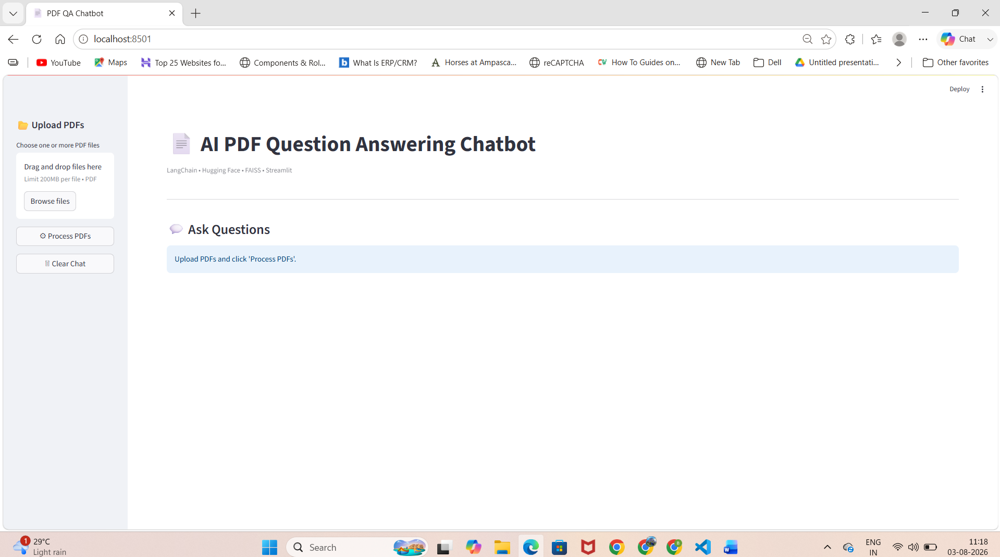
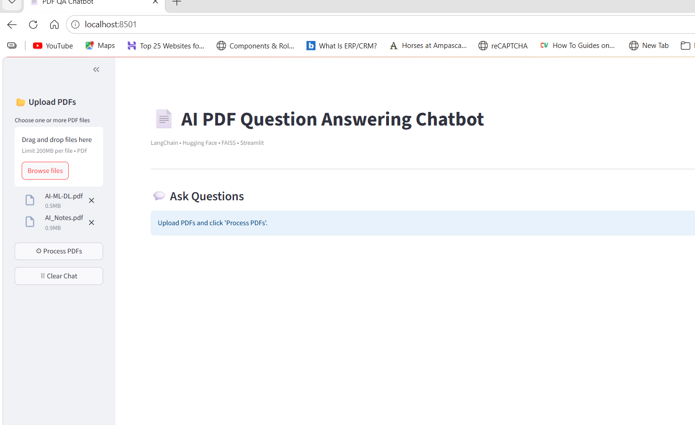
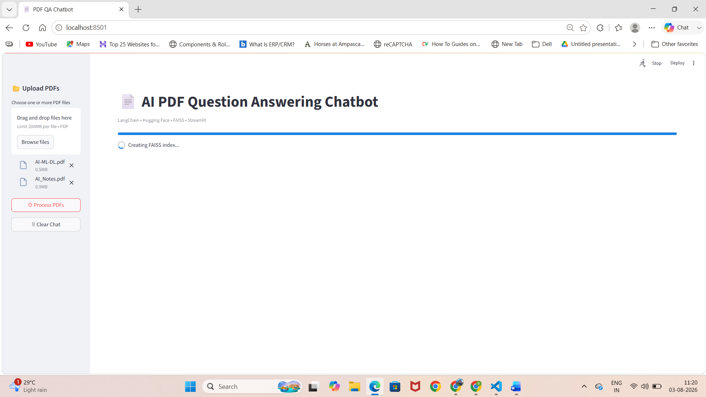
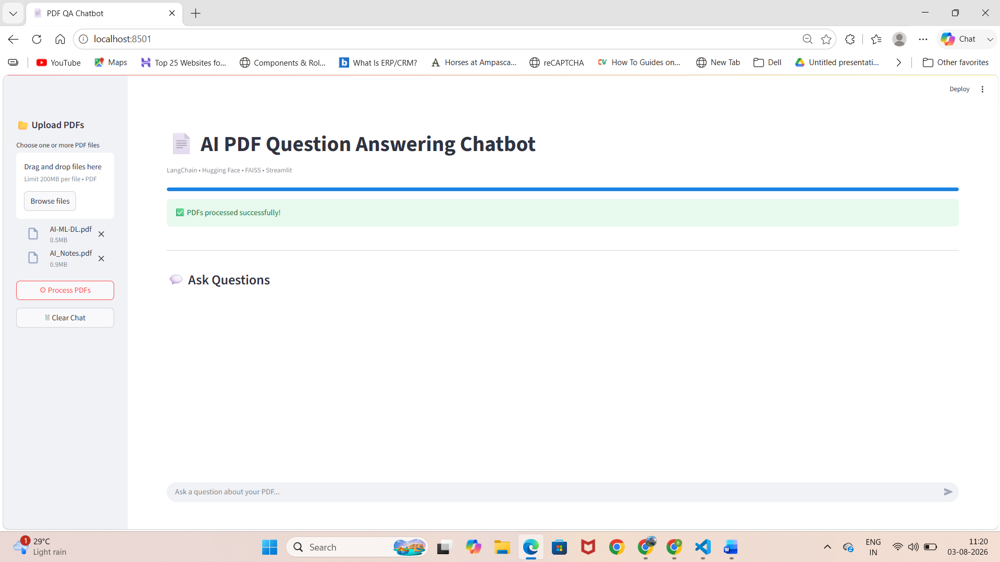
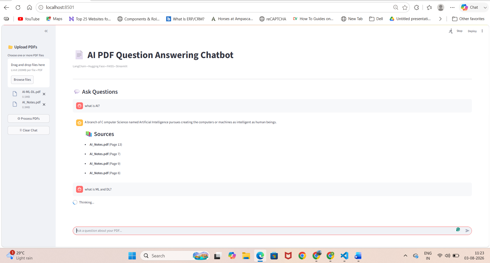
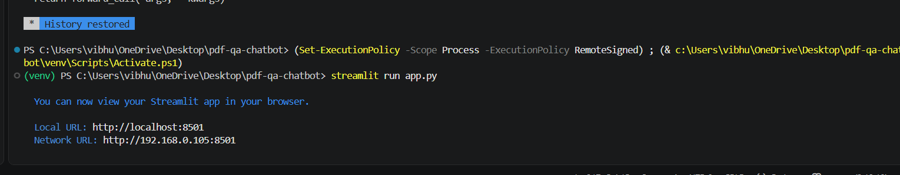

# 📄 AI-Powered PDF Question Answering Chatbot

An AI-powered PDF Question Answering (RAG) chatbot built using **Python, Streamlit, LangChain, Hugging Face, and FAISS**.

---

## 🚀 Features

- Upload one or multiple PDF files
- Semantic search using FAISS
- Question Answering using Google FLAN-T5
- ChatGPT-like interface
- Displays Source PDF and Page Number
- Local deployment (No paid APIs)

---

## 🛠 Tech Stack

- Python
- Streamlit
- LangChain
- Hugging Face Transformers
- Sentence Transformers
- FAISS
- PyPDF

---

## 📂 Project Structure

```text
src/
├── config.py
├── pdf_loader.py
├── text_splitter.py
├── embeddings.py
├── vector_db.py
├── llm.py
├── prompt.py
├── rag_pipeline.py
```

---

# 📸 Screenshots

## Home Screen



---

## Upload PDF



---

## Processing PDF



---

## Chat Interface



---

## Generated Answer



---

## Terminal Execution



---

# ▶️ Installation

```bash
git clone https://github.com/ishitaboghara/PDF-QA-Chatbot.git

cd PDF-QA-Chatbot

pip install -r requirements.txt

streamlit run app.py
```

---

## 👩‍💻 Author

**Ishita Boghara**

MCA Student

SNDT Women's University
